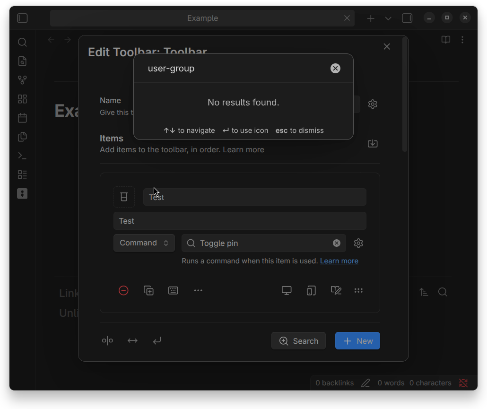
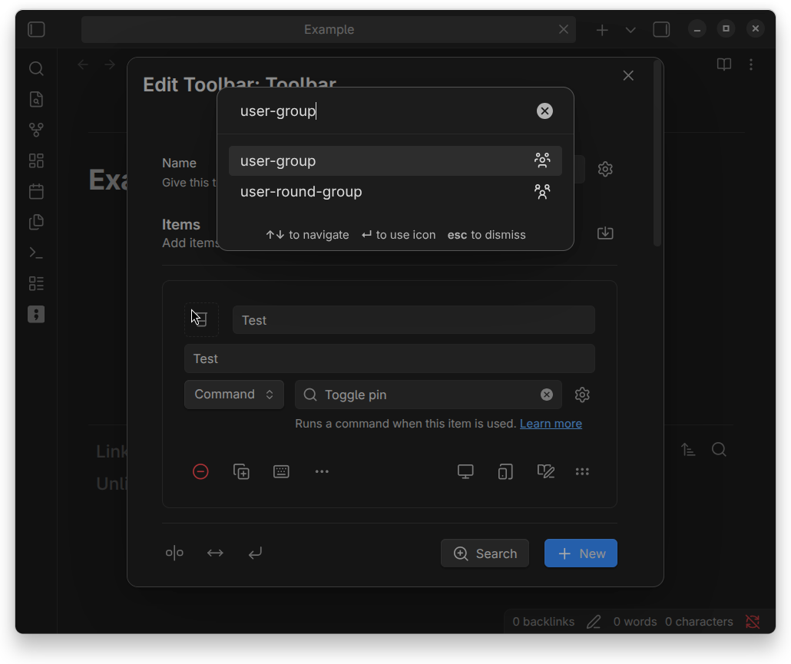

# Mainstream Icons - Obsdian Plugin

![latest-version] ![current-downloads] ![current-stars] ![open-issues]

Inject additional mainstream icons from Lucide and Lucide Lab to Obsidian.

## Overview

Obsidian already ships most of Lucide icons to its app. Although, It's still missing latest mainstream icons from Lucide such as `list-clock` (![lucide-list-clock]) and `user-group` (![lucide-user-group]) icons. That's why Mainstream Icons was created to address that lack of things by injecting latest mainstream icons to the core of the Obsidian app.

> [!NOTE]
>
> Please note that this plugin is **not intended to customize icons on its own**. Rather, it merely provides additional icons for use by Obsidian and other plugins.

Example using [Note Toolbar][note-toolbar] plugin:

| Plugin disabled                                      | Plugin enabled                                     |
| ---------------------------------------------------- | -------------------------------------------------- |
|  |  |

## Notes for developers

To insert additional icon, you can use the same method as inserting icon using [`getIcon()`][obsidian-docs-get-icon] or [`setIcon()`][obsidian-docs-set-icon]:

```typescript
import { getIcon, setIcon } from 'obsidian';

// Get icon svg and insert it
let iconEl = createDiv();
let iconSvg = getIcon('lucide-user-group');
if (iconSvg) iconEl.append(iconSvg);

// Or, insert it immediately
let anotherIconEl = createDiv();
setIcon(anotherIconEl, 'lucide-user-group');
```

But, **why don't we use [`addIcon()`][obsidian-docs-add-icon] to extend existing icons?** Indeed, Obsidian already provides us that function as a solution to use external icons as we want. Although, Obsidian will automatically set the view box of the SVG element to `0 0 100 100` (i.e. wrapped in just `<svg viewBox="0 0 100 100">...</svg>`), while Obsidian treats internal icons differently (by wrapping them in `<svg viewBox="0 0 24 24" width="24" height="24" fill="none" stroke="currentColor">...</svg>`).

It's not a really big deal though. However, especially for me who want to achieve consistency, it can be a little frustating sometimes.

## Installation

### In-app installation

1. Open settings.
2. Choose "Community plugins" setting tab.
3. Turn off "Restricted mode" if it was enabled before.
4. Click "Browse" at "Community plugins" item.
5. Type "Mainstream Icons" in the search box.
6. Install and enable it.

### Manual installation

1. Create a folder named `mainstream-icons` under `YOUR_VAULT_NAME/.obsidian/plugins`.
2. Place `manifest.json`, `main.js`, and `style.css` from the latest release into the folder.
3. Enable it through the "Community plugin" setting tab.

### Using [BRAT][]

## Attribution

Lucide is a trademark of [Lucide Icons][Lucide], which is licensed under MIT. This plugin is not affiliated with or endorsed by Lucide Icons.

[BRAT]: https://github.com/TfTHacker/obsidian42-brat
[Lucide]: https://lucide.dev
[note-toolbar]: https://github.com/chrisgurney/obsidian-note-toolbar

[lucide-list-clock]: https://unpkg.com/lucide-static@latest/icons/list-clock.svg
[lucide-user-group]: https://unpkg.com/lucide-static@latest/icons/user-group.svg

[obsidian-docs-add-icon]: https://docs.obsidian.md/Reference/TypeScript+API/addIcon
[obsidian-docs-get-icon]: https://docs.obsidian.md/Reference/TypeScript+API/getIcon
[obsidian-docs-set-icon]: https://docs.obsidian.md/Reference/TypeScript+API/setIcon

[latest-version]: https://img.shields.io/github/manifest-json/v/kotaindah55/mainstream-icons?label=version&link=https%3A%2F%2Fgithub.com%2Fkotaindah55%mainstream-icons%2Freleases
[current-downloads]: https://img.shields.io/badge/dynamic/json?url=https%3A%2F%2Fgithub.com%2Fobsidianmd%2Fobsidian-releases%2Fraw%2Frefs%2Fheads%2Fmaster%2Fcommunity-plugin-stats.json&query=%24.mainstream-icons.downloads&label=downloads&color=green
[current-stars]: https://img.shields.io/github/stars/kotaindah55/mainstream-icons?style=flat&link=https%3A%2F%2Fgithub.com%2Fkotaindah55%mainstream-icons%2Fstargazers
[open-issues]: https://img.shields.io/github/issues-search?query=repo%3Akotaindah55%mainstream-icons%20is%3Aopen&label=open%20issues&color=red&link=https%3A%2F%2Fgithub.com%2Fkotaindah55%mainstream-icons%2Fissues
